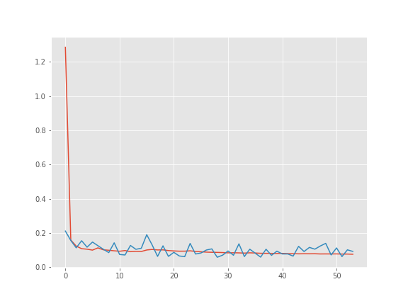
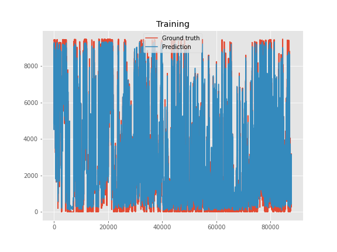
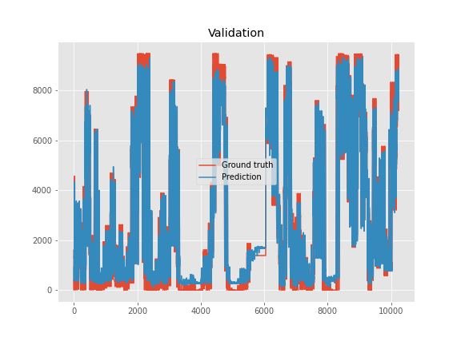

This repository builds a neural net based on a stacked LSTM structure with a lot of parameters. 
The target is to predict the power generation of a wind park given the temperature, pressure, wind direction and wind speed.
Due to the large amount of parameters, training on a GPU is absolutely mandatory. 
I trained the model on the Google colab infrastructure.

 This graph shows the training process in dependence of the training epochs.

 This graph shows the predicted training data versus the actual training data.

 This graph shows the predicted validation data versus the actual validation data.

 This graph shows the predicted test data versus the actual test data.

